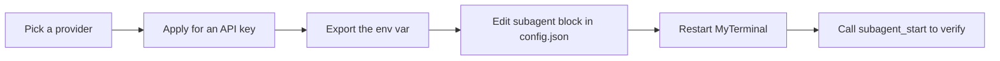

# Set up the Subagent LLM provider

[中文](SUBAGENT_SETUP.zh-CN.md) · [GPT Action setup](ACTIONS_SETUP.md) · [Manual install](MANUAL_INSTALL.md) · [Privacy](PRIVACY.md)

MyTerminal's subagent system delegates a bounded task to an isolated agent loop that runs against a separate LLM call. The subagent carries its own tool set, context window, cost tracker, and abort handle. The main session starts it with `subagent_start`, polls `subagent_status`, and cancels with `subagent_abort`. To use it you must configure **one** LLM provider and supply its API key as an environment variable. The API key is never stored in `config.json`.

> The subagent system is opt-in. If `subagent.enabled` is `false` or the matching environment variable is missing, `subagent_start` returns a clear error and no remote call is attempted.

## The complete path



## 1. Pick a provider

MyTerminal supports five providers. Pick the one whose model and pricing fit your workload. The default is `openai` with `gpt-4o`.

| Provider | Console | Environment variable | Recommended model | Notes |
|----------|---------|----------------------|-------------------|-------|
| `openai` | platform.openai.com/api-keys | `OPENAI_API_KEY` | `gpt-4o` | Default. Pay-as-you-go. |
| `anthropic` | console.anthropic.com | `ANTHROPIC_API_KEY` | `claude-3-5-sonnet-20241022` | Pay-as-you-go. Native protocol. |
| `deepseek` | platform.deepseek.com | `DEEPSEEK_API_KEY` | `deepseek-chat` | Cost-efficient. OpenAI-compatible. |
| `glm` | open.bigmodel.cn | `GLM_API_KEY` | `glm-4` or `glm-4-flash` | Zhipu AI. OpenAI-compatible. |
| `qwen` | dashscope.aliyuncs.com | `DASHSCOPE_API_KEY` (+ optional `DASHSCOPE_BASE_URL`) | `qwen3.7-max` or `qwen-max` | Alibaba Cloud DashScope. Up to 1M context. |

All five providers use OpenAI-compatible HTTP protocols except `anthropic`, which uses Anthropic's native Messages API.

## 2. Apply for an API key

Sign in to the provider console, create an API key, and copy the value. Treat the key as a long-lived secret: store it only in your shell profile or a secrets manager, never in `config.json` or any file under the workspace.

### openai

1. Visit <https://platform.openai.com/api-keys>.
2. Click **Create new secret key**.
3. Copy the value that starts with `sk-`.

### anthropic

1. Visit <https://console.anthropic.com>.
2. Navigate to **Settings → API Keys**.
3. Click **Create Key** and copy the value that starts with `sk-ant-`.

### deepseek

1. Visit <https://platform.deepseek.com>.
2. Open **API Keys** and create a key.
3. Copy the value that starts with `sk-`.

### glm (Zhipu)

1. Visit <https://open.bigmodel.cn>.
2. Navigate to the API keys page.
3. Create a key and copy the value.

### qwen (Alibaba Cloud DashScope)

1. Visit <https://dashscope.aliyuncs.com>.
2. Sign in with an Alibaba Cloud account.
3. Navigate to **API-KEY 管理** and create a key.
4. (Optional) If you have a dedicated DashScope instance, copy its endpoint as `DASHSCOPE_BASE_URL`. Otherwise the public endpoint `https://dashscope.aliyuncs.com/compatible-mode/v1` is used.

## 3. Export the environment variable

Add the export line to your shell profile (`~/.zshrc` on macOS, `~/.bashrc` on Linux). Use exactly one provider block.

### macOS (zsh)

```bash
# Pick ONE block that matches your provider:

# openai
export OPENAI_API_KEY=sk-your-key-here

# anthropic
export ANTHROPIC_API_KEY=sk-ant-your-key-here

# deepseek
export DEEPSEEK_API_KEY=sk-your-key-here

# glm
export GLM_API_KEY=your-glm-key-here

# qwen
export DASHSCOPE_API_KEY=sk-your-dashscope-key-here
# Optional: dedicated DashScope instance endpoint
# export DASHSCOPE_BASE_URL=https://your-instance.aliyuncs.com/compatible-mode/v1
```

Then reload the profile in every terminal that runs MyTerminal:

```bash
source ~/.zshrc
```

### Linux (bash)

```bash
# Same export lines as above, appended to ~/.bashrc
source ~/.bashrc
```

### Verify the variable is visible to MyTerminal

```bash
echo $DASHSCOPE_API_KEY   # or whichever variable you set
```

If the command prints your key, MyTerminal will see it. If it prints nothing, the export did not take effect in the shell that launches MyTerminal.

## 4. Edit the subagent block in config.json

MyTerminal reads its settings from `~/.config/myterminal/config.json` by default. Override the location with `MYTERMINAL_CONFIG_DIR` or `XDG_CONFIG_HOME` if needed.

Open the file and locate (or add) the `subagent` block:

```json
{
  "subagent": {
    "enabled": true,
    "provider": "qwen",
    "model": "qwen3.7-max",
    "maxTurns": 50,
    "timeoutSec": 300,
    "maxParallel": 2
  }
}
```

### Field reference

| Field | Type | Range | Default | Description |
|-------|------|-------|---------|-------------|
| `enabled` | boolean | `true` / `false` | `true` | Master switch. When `false`, `subagent_start` is rejected. |
| `provider` | string | `openai` / `anthropic` / `deepseek` / `glm` / `qwen` | `openai` | Must match the environment variable you exported. |
| `model` | string | provider-specific | `gpt-4o` | Model name accepted by the provider. |
| `maxTurns` | integer | 1 – 200 | `50` | Maximum agent-loop turns per subagent. |
| `timeoutSec` | integer | 30 – 3600 | `300` | Wall-clock timeout in seconds. |
| `maxParallel` | integer | 1 – 4 | `2` | Maximum concurrent subagents in this MyTerminal instance. |
| `fallbackModel` | string (optional) | provider-specific | none | Model used if the primary model fails. Omit to disable fallback. |

Illegal values are corrected automatically: an unknown `provider` falls back to `openai`, an out-of-range integer is clamped to the nearest bound. Validation warnings surface in the MyTerminal startup log.

## 5. Restart MyTerminal and verify

Settings are read at startup. After editing `config.json`, fully exit MyTerminal and start it again. Then trigger a subagent through any client (TUI, GPT Action, or MCP connector) and watch the response.

If the environment variable is missing, the error is explicit:

```
DASHSCOPE_API_KEY is not set. Please add "export DASHSCOPE_API_KEY=sk-..." to your shell profile.
```

If `provider` does not match the exported variable, the same class of error appears for the variable that the configured provider expects.

If both are correct, `subagent_start` returns a `taskId` immediately. Poll `subagent_status` with that `taskId` until `status` reaches `completed`, `failed`, or `aborted`. The final result includes the token usage.

## 6. Per-call overrides (optional)

Callers may override the configured `provider`, `model`, `maxTurns`, and `timeoutSec` per `subagent_start` invocation. This is useful for routing a one-off task to a stronger model without changing global settings. The override does not change `config.json`; it only applies to that single subagent. The matching environment variable must still be exported.

The `skill` tool's `fork` mode also accepts `forkOptions`, but it can only set **engineering** parameters (`maxTurns`, `timeoutSec`, `readOnly`, `deliverables`, `acceptanceCriteria`, `constraints`) for the spawned subagent. The `model` and `provider` are fixed by global configuration and **cannot** be overridden by a skill.

## 7. Token usage

Every subagent records its token usage (input, output, and cache-read tokens). As of ADR-0046, `src/subagent/cost-tracker.ts` is a pure token accumulator — there is no pricing table and no cost estimation. Token counts are for visibility only; MyTerminal never enforces a budget limit. The safety nets are `maxTurns`, `timeoutSec`, `maxParallel`, and explicit `subagent_abort`.

## 8. Privacy

- API keys are read from environment variables only. MyTerminal never writes them to disk.
- `config.json` contains the MyTerminal session credentials (`connectorKey`, `actionsToken`) but **not** provider API keys.
- Subagent prompts, tool inputs, and outputs stay on your machine. The provider receives only the LLM request payload, exactly as if you called its API directly.
- See [PRIVACY.md](PRIVACY.md) for the full data-flow description.

## 9. Troubleshooting

| Symptom | Likely cause | Fix |
|---------|--------------|-----|
| `XXX_API_KEY is not set` error on `subagent_start` | Environment variable missing in the shell that launched MyTerminal. | Add the export to `~/.zshrc` (or `~/.bashrc`), `source` it, then restart MyTerminal. |
| `Unknown provider: X` error | Typo in `config.json`'s `subagent.provider`. | Use one of `openai`, `anthropic`, `deepseek`, `glm`, `qwen`. |
| Subagent returns 401 from provider | Key rejected by provider (revoked, wrong account, insufficient credit). | Regenerate the key in the provider console and update the export. |
| Subagent returns 429 | Provider rate limit reached. | Reduce `maxParallel`, slow down polling, or upgrade provider quota. |
| Subagent returns 400 with `context_length_exceeded` | The task plus tool outputs exceeded the model's context window. | Switch to a model with a larger window (e.g. `qwen3.7-max` for 1M) or split the task. |
| `subagent_start` is rejected with `FORBIDDEN` | You hit `maxParallel` concurrent subagents, or you tried to start a subagent from inside another subagent (recursion guard). | Wait for an existing subagent to finish, or call from the root session. |
