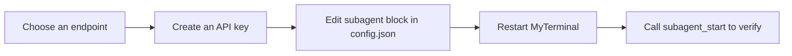

# Set up the Subagent LLM endpoint

[中文](SUBAGENT_SETUP.zh-CN.md) · [GPT Action setup](ACTIONS_SETUP.md) · [Manual install](MANUAL_INSTALL.md) · [Privacy](PRIVACY.md)

MyTerminal's subagent system delegates a bounded task to an isolated agent loop that runs against a separate LLM endpoint. The subagent carries its own tool set, context window, token usage tracker, and abort handle. The main session starts it with `subagent_start`, polls `subagent_status`, and cancels with `subagent_abort`. To use it, configure one Anthropic-Messages-compatible endpoint in `config.json` (`subagent.apiKey` / `subagent.baseUrl` / `subagent.model` — all three are required).

> The subagent system is opt-in. If `subagent.enabled` is `false` or any of the three required fields is missing, `subagent_start` returns a clear error and no remote call is attempted.

## The complete path



## 1. Choose an endpoint

MyTerminal speaks the **Anthropic Messages protocol**. Any endpoint that implements that protocol works — Anthropic's own API (`https://api.anthropic.com`) or a compatible gateway/proxy with a custom `baseUrl`. The LLM model, endpoint, and key are all configured in `config.json`; there is no per-provider concept anymore. A legacy `provider` field in the `subagent` block is silently ignored.

## 2. Create an API key

For Anthropic itself, sign in at <https://console.anthropic.com>, navigate to **Settings → API Keys**, click **Create Key**, and copy the value that starts with `sk-ant-`. For a compatible gateway, follow that provider's own instructions. Treat the key as a long-lived secret: store it only in `config.json` (see [Privacy](#8-privacy)), never in a file under the workspace.

## 3. Edit the subagent block in config.json

MyTerminal reads its settings from `~/.config/myterminal/config.json` by default. Override the location with `MYTERMINAL_CONFIG_DIR` or `XDG_CONFIG_HOME` if needed.

Open the file and locate (or add) the `subagent` block:

```json
{
  "subagent": {
    "enabled": true,
    "model": "claude-3-5-sonnet-20241022",
    "baseUrl": "https://api.anthropic.com",
    "apiKey": "sk-ant-your-key-here",
    "maxTurns": 50,
    "timeoutSec": 300,
    "maxParallel": 2
  }
}
```

### Field reference

| Field | Type | Default | Description |
|-------|------|---------|-------------|
| `enabled` | boolean | `true` | Master switch. When `false`, `subagent_start` is rejected. |
| `model` | string | — (required) | Model name accepted by the endpoint. |
| `baseUrl` | string | — (required) | Anthropic-Messages-compatible endpoint URL. |
| `apiKey` | string | — (required) | API key for the endpoint. |
| `maxTurns` | integer | `50` | Maximum agent-loop turns per subagent. |
| `timeoutSec` | integer | `300` | Wall-clock timeout in seconds. |
| `maxParallel` | integer | `2` | Maximum concurrent subagents in this MyTerminal instance. |
| `contextWindow` | integer (optional) | `120000` | Subagent context window; code never looks up a model table. |
| `maxOutput` | integer (optional) | `32000` | Maximum output tokens per LLM call. |
| `compactThreshold` | integer (optional) | `80000` | Context size that triggers compaction. |
| `fallbackModel` | string (optional) | none | Model used when the endpoint returns 529 overload. Omit to disable fallback. Env `MYTERMINAL_SUBAGENT_FALLBACK_MODEL` overrides it. |

Out-of-range integers are clamped to the nearest bound. Missing `model`, `baseUrl`, or `apiKey` fails validation with a startup-log error. A legacy `provider` field is silently ignored.

## 4. Restart MyTerminal and verify

Settings are read at startup. After editing `config.json`, fully exit MyTerminal and start it again. Then trigger a subagent through any client (TUI, GPT Action, or MCP connector) and watch the response.

If the required fields are missing or empty, the error is explicit:

```
Subagent apiKey, baseUrl and model are required. Provide them in the MyTerminal config file (subagent.apiKey / subagent.baseUrl / subagent.model).
```

When configured correctly, `subagent_start` returns `{sessionId, taskId, status: "running"}` immediately. Poll `subagent_status` with that `taskId` until `status` reaches `completed`, `failed`, or `aborted`. The final result includes the token usage.

## 5. Per-call overrides (optional)

Callers may override `maxTurns`, `timeoutSec`, and `readOnly` per `subagent_start` invocation. The override does not change `config.json`; it only applies to that single subagent. `model`, `baseUrl`, and `apiKey` are fixed by global configuration and **cannot** be overridden per call.

The `skill` tool's `fork` mode also accepts `forkOptions`, but it can only set **engineering** parameters (`maxTurns`, `timeoutSec`, `readOnly`, `deliverables`, `acceptanceCriteria`, `constraints`) for the spawned subagent. The endpoint configuration is fixed by global configuration and **cannot** be overridden by a skill.

## 6. Token usage

Every subagent records its token usage (input, output, and cache-read tokens). As of ADR-0046, `src/subagent/cost-tracker.ts` is a pure token accumulator — there is no pricing table and no cost estimation. Token counts are for visibility only; MyTerminal never enforces a budget limit. The safety nets are `maxTurns`, `timeoutSec`, `maxParallel`, and explicit `subagent_abort`.

## 7. Privacy

- The subagent API key is stored in `config.json` alongside the MyTerminal session credentials (`connectorKey`, `actionsToken`). It is never written to logs, audit records, TUI state, or any file under the workspace.
- Subagent prompts, tool inputs, and outputs stay on your machine. The endpoint receives only the LLM request payload, exactly as if you called its API directly.
- See [PRIVACY.md](PRIVACY.md) for the full data-flow description.

## 8. Troubleshooting

| Symptom | Likely cause | Fix |
|---------|--------------|-----|
| `Subagent apiKey, baseUrl and model are required...` on `subagent_start` | `config.json`'s `subagent` block is missing one of `model`, `baseUrl`, `apiKey`. | Add all three required fields and restart MyTerminal. |
| Subagent returns 401 from the endpoint | Key rejected (revoked, wrong account, insufficient credit). | Regenerate the key in the provider console and update `config.json`. |
| Subagent returns 429 | Endpoint rate limit reached. | Reduce `maxParallel`, slow down polling, or upgrade endpoint quota. |
| Subagent returns 400 with `context_length_exceeded` | The task plus tool outputs exceeded the subagent context window. | Raise `subagent.contextWindow`, or split the task. |
| `subagent_start` is rejected with `FORBIDDEN` | You hit `maxParallel` concurrent subagents, or you tried to start a subagent from inside another subagent (recursion guard). | Wait for an existing subagent to finish, or call from the root session. |
| The old `provider` setting does nothing | The provider concept was removed; the endpoint is now fully described by `model`/`baseUrl`/`apiKey`. | Remove `provider` and configure the three required fields. |
