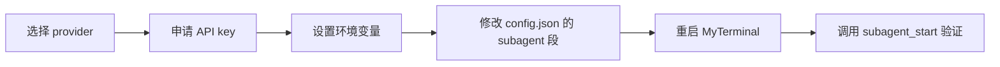

# 配置 Subagent LLM Provider

[English](SUBAGENT_SETUP.md) · [GPT Action 配置](ACTIONS_SETUP.zh-CN.md) · [手动安装](MANUAL_INSTALL.md) · [隐私说明](PRIVACY.zh-CN.md)

MyTerminal 的 subagent 系统把一个有边界的任务委派给一个隔离的 agent loop，该 loop 走独立的 LLM 调用。subagent 自带工具集、上下文窗口、成本追踪和 abort 句柄。主会话用 `subagent_start` 启动它，用 `subagent_status` 轮询，用 `subagent_abort` 取消。要使用它，你必须配置**一个** LLM provider，并把对应的 API key 作为环境变量提供。API key **绝不**写入 `config.json`。

> subagent 系统是 opt-in 的。如果 `subagent.enabled` 为 `false` 或对应的环境变量缺失，`subagent_start` 会返回明确的错误，不会发起任何远端调用。

## 完整路径



## 1. 选择 provider

MyTerminal 支持 5 个 provider。根据你的模型需求和预算选一个。默认是 `openai` 配 `gpt-4o`。

| Provider | 控制台 | 环境变量 | 推荐 model | 说明 |
|----------|--------|---------|-----------|------|
| `openai` | platform.openai.com/api-keys | `OPENAI_API_KEY` | `gpt-4o` | 默认。按量计费。 |
| `anthropic` | console.anthropic.com | `ANTHROPIC_API_KEY` | `claude-3-5-sonnet-20241022` | 按量计费。原生协议。 |
| `deepseek` | platform.deepseek.com | `DEEPSEEK_API_KEY` | `deepseek-chat` | 性价比高。OpenAI 兼容协议。 |
| `glm` | open.bigmodel.cn | `GLM_API_KEY` | `glm-4` 或 `glm-4-flash` | 智谱 AI。OpenAI 兼容协议。 |
| `qwen` | dashscope.aliyuncs.com | `DASHSCOPE_API_KEY`（+ 可选 `DASHSCOPE_BASE_URL`） | `qwen3.7-max` 或 `qwen-max` | 阿里云 DashScope。最高 1M 上下文。 |

除 `anthropic` 走 Anthropic 原生 Messages API 外，其余 4 个都走 OpenAI 兼容 HTTP 协议。

## 2. 申请 API key

登录 provider 控制台，创建一个 API key 并复制其值。把这个 key 当作长期密钥处理：只放在 shell profile 或密钥管理器里，**绝不**写入 `config.json` 或工作区下任何文件。

### openai

1. 访问 <https://platform.openai.com/api-keys>。
2. 点击 **Create new secret key**。
3. 复制以 `sk-` 开头的值。

### anthropic

1. 访问 <https://console.anthropic.com>。
2. 进入 **Settings → API Keys**。
3. 点击 **Create Key**，复制以 `sk-ant-` 开头的值。

### deepseek

1. 访问 <https://platform.deepseek.com>。
2. 打开 **API Keys**，创建一个 key。
3. 复制以 `sk-` 开头的值。

### glm（智谱）

1. 访问 <https://open.bigmodel.cn>。
2. 进入 API keys 页面。
3. 创建 key 并复制值。

### qwen（阿里云 DashScope）

1. 访问 <https://dashscope.aliyuncs.com>。
2. 用阿里云账号登录。
3. 进入 **API-KEY 管理**，创建一个 key。
4. （可选）如果你有 DashScope 专属实例，把端点复制为 `DASHSCOPE_BASE_URL`；否则使用公共端点 `https://dashscope.aliyuncs.com/compatible-mode/v1`。

## 3. 设置环境变量

把 export 行加到你的 shell profile（macOS 是 `~/.zshrc`，Linux 是 `~/.bashrc`）。**只用其中一个 provider 块**。

### macOS（zsh）

```bash
# 根据你的 provider 选其中一块：

# openai
export OPENAI_API_KEY=sk-your-key-here

# anthropic
export ANTHROPIC_API_KEY=sk-ant-your-key-here

# deepseek
export DEEPSEEK_API_KEY=sk-your-key-here

# glm
export GLM_API_KEY=your-glm-key-here

# qwen
export DASHSCOPE_API_KEY=sk-your-dashscope-key-here
# 可选：DashScope 专属实例端点
# export DASHSCOPE_BASE_URL=https://your-instance.aliyuncs.com/compatible-mode/v1
```

然后在每个运行 MyTerminal 的终端里 reload profile：

```bash
source ~/.zshrc
```

### Linux（bash）

```bash
# 同上的 export 行，追加到 ~/.bashrc
source ~/.bashrc
```

### 验证 MyTerminal 能看到变量

```bash
echo $DASHSCOPE_API_KEY   # 或你设置的那个变量
```

如果命令打印出你的 key，MyTerminal 就能看到。如果什么都没打印，说明启动 MyTerminal 的那个 shell 里 export 没生效。

## 4. 修改 config.json 的 subagent 段

MyTerminal 默认从 `~/.config/myterminal/config.json` 读设置。如需改位置，用 `MYTERMINAL_CONFIG_DIR` 或 `XDG_CONFIG_HOME` 环境变量覆盖。

打开文件，找到（或新增）`subagent` 段：

```json
{
  "subagent": {
    "enabled": true,
    "provider": "qwen",
    "model": "qwen3.7-max",
    "maxTurns": 50,
    "timeoutSec": 300,
    "maxParallel": 2
  }
}
```

### 字段说明

| 字段 | 类型 | 范围 | 默认值 | 说明 |
|------|------|------|--------|------|
| `enabled` | 布尔 | `true` / `false` | `true` | 总开关。为 `false` 时 `subagent_start` 被拒绝。 |
| `provider` | 字符串 | `openai` / `anthropic` / `deepseek` / `glm` / `qwen` | `openai` | 必须与你 export 的环境变量对应。 |
| `model` | 字符串 | provider 特定 | `gpt-4o` | provider 接受的模型名。 |
| `maxTurns` | 整数 | 1 – 200 | `50` | 每个 subagent 的 agent loop 轮次上限。 |
| `timeoutSec` | 整数 | 30 – 3600 | `300` | 整体超时秒数。 |
| `maxParallel` | 整数 | 1 – 4 | `2` | 本 MyTerminal 实例的最大并发 subagent 数。 |
| `fallbackModel` | 字符串（可选） | provider 特定 | 无 | 主模型失败时使用的降级模型。省略则不降级。 |

非法值会被自动纠正：未知的 `provider` 降级为 `openai`，越界整数被钳制到最近边界。校验告警会出现在 MyTerminal 启动日志里。

## 5. 重启 MyTerminal 并验证

设置在启动时读取。改完 `config.json` 后，完全退出 MyTerminal 再重启。然后用任意客户端（TUI、GPT Action、MCP connector）触发一个 subagent，观察返回。

如果环境变量缺失，错误信息很明确：

```
DASHSCOPE_API_KEY is not set. Please add "export DASHSCOPE_API_KEY=sk-..." to your shell profile.
```

如果 `provider` 与 export 的变量不匹配，会出现同类错误，提示该 provider 期望的变量名。

两者都正确时，`subagent_start` 立即返回一个 `taskId`。用该 `taskId` 轮询 `subagent_status`，直到 `status` 变为 `completed`、`failed` 或 `aborted`。最终结果包含 USD 成本和 token 用量。

## 6. 按调用覆盖（可选）

调用方可以在单次 `subagent_start` 中覆盖 `provider`、`model`、`maxTurns`、`timeoutSec`。这适合把一次性任务路由到更强的模型而不改全局设置。覆盖不修改 `config.json`，只对该 subagent 生效。对应的 provider 环境变量仍必须已 export。

`skill` 工具的 `fork` 模式也接受 `forkOptions`，可以为 skill 派生的 subagent 覆盖这些字段。完整 schema 见 `docs/adr/0010-skill-invoke-tool-v2.md`。

## 7. 成本追踪

每个 subagent 会记录 token 用量和估算的 USD 成本。定价表在 `src/subagent/cost-tracker.ts`，按模型名索引并带前缀匹配 fallback。如果你用的模型不在表里，会用同 provider 家族里最接近的已知模型并打一条警告。成本只用于可见性——MyTerminal **绝不**强制预算限制。安全网是 `maxTurns`、`timeoutSec`、`maxParallel` 和显式的 `subagent_abort`。

## 8. 隐私

- API key 只从环境变量读取。MyTerminal **绝不**把 key 写到磁盘。
- `config.json` 含 MyTerminal 会话凭证（`connectorKey`、`actionsToken`），但**不含** provider API key。
- subagent 的 prompt、工具输入输出都留在你本机。provider 只收到 LLM 请求载荷，与你直接调它的 API 完全一样。
- 完整数据流描述见 [PRIVACY.zh-CN.md](PRIVACY.zh-CN.md)。

## 9. 常见错误排查

| 症状 | 可能原因 | 修复 |
|------|---------|------|
| `subagent_start` 报 `XXX_API_KEY is not set` | 启动 MyTerminal 的 shell 里没设环境变量。 | 把 export 加到 `~/.zshrc`（或 `~/.bashrc`），`source` 一下，再重启 MyTerminal。 |
| 报 `Unknown provider: X` | `config.json` 的 `subagent.provider` 拼错。 | 用 `openai` / `anthropic` / `deepseek` / `glm` / `qwen` 之一。 |
| subagent 收到 provider 的 401 | key 被拒（已撤销、账号错、余额不足）。 | 在 provider 控制台重新生成 key 并更新 export。 |
| subagent 收到 429 | 触发 provider 限流。 | 降低 `maxParallel`，减慢轮询频率，或升级 provider 配额。 |
| subagent 收到 400 且含 `context_length_exceeded` | 任务加工具输出超出了模型上下文窗口。 | 换更大窗口的模型（如 `qwen3.7-max` 支持 1M），或拆分任务。 |
| `subagent_start` 被拒返回 `FORBIDDEN` | 达到 `maxParallel` 并发上限，或在另一个 subagent 内部又启 subagent（递归防护）。 | 等现有 subagent 完成，或从 root session 调用。 |
| 结果里成本显示 `0` | 模型名没命中定价表，fallback 到了免费档。 | 确认 `config.json` 里的模型名与 provider 官方名称一致。 |
