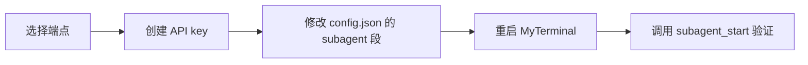

# 配置 Subagent LLM 端点

[English](SUBAGENT_SETUP.md) · [GPT Action 配置](ACTIONS_SETUP.zh-CN.md) · [手动安装](MANUAL_INSTALL.md) · [隐私说明](PRIVACY.zh-CN.md)

MyTerminal 的 subagent 系统把一个有边界的任务委派给一个隔离的 agent loop，该 loop 走独立的 LLM 调用。subagent 自带工具集、上下文窗口、token 追踪器和 abort 句柄。主会话用 `subagent_start` 启动它，用 `subagent_status` 轮询，用 `subagent_abort` 取消。要使用它，你必须在 `config.json` 里配置一个 Anthropic Messages 兼容端点（`subagent.apiKey` / `subagent.baseUrl` / `subagent.model` **三必填**）。

> subagent 系统是 opt-in 的。如果 `subagent.enabled` 为 `false` 或三个必填字段缺任一，`subagent_start` 会返回明确的错误，不会发起任何远端调用。

## 完整路径



## 1. 选择端点

MyTerminal 只讲 **Anthropic Messages 协议**。任何实现该协议的端点都可用——Anthropic 官方 API（`https://api.anthropic.com`）或带自定义 `baseUrl` 的兼容网关/代理。模型、端点和 key 全部配置在 `config.json` 中，不再有 per-provider 概念；`subagent` 段遗留的 `provider` 字段会被静默忽略。

## 2. 创建 API key

官方 Anthropic：访问 <https://console.anthropic.com>，进入 **Settings → API Keys**，点击 **Create Key**，复制以 `sk-ant-` 开头的值。兼容网关按该提供方自己的说明操作。把 key 当作长期密钥对待：只存在 `config.json` 里（见 [隐私](#7-隐私)），绝不放进工作区下任何文件。

## 3. 修改 config.json 的 subagent 段

MyTerminal 默认从 `~/.config/myterminal/config.json` 读设置。如需改位置，用 `MYTERMINAL_CONFIG_DIR` 或 `XDG_CONFIG_HOME` 环境变量覆盖。

打开文件，找到（或新增）`subagent` 段：

```json
{
  "subagent": {
    "enabled": true,
    "model": "claude-3-5-sonnet-20241022",
    "baseUrl": "https://api.anthropic.com",
    "apiKey": "sk-ant-your-key-here",
    "maxTurns": 50,
    "timeoutSec": 300,
    "maxParallel": 2
  }
}
```

### 字段说明

| 字段 | 类型 | 默认值 | 说明 |
|------|------|--------|------|
| `enabled` | 布尔 | `true` | 总开关。为 `false` 时 `subagent_start` 被拒绝。 |
| `model` | 字符串 | —（必填） | 端点接受的模型名。 |
| `baseUrl` | 字符串 | —（必填） | Anthropic Messages 兼容端点 URL。 |
| `apiKey` | 字符串 | —（必填） | 端点 API key。 |
| `maxTurns` | 整数 | `50` | 每个 subagent 的 agent loop 轮次上限。 |
| `timeoutSec` | 整数 | `300` | 整体超时秒数。 |
| `maxParallel` | 整数 | `2` | 本 MyTerminal 实例的最大并发 subagent 数。 |
| `contextWindow` | 整数（可选） | `120000` | subagent 上下文窗口；代码不查模型表。 |
| `maxOutput` | 整数（可选） | `32000` | 单次 LLM 调用最大输出 token。 |
| `compactThreshold` | 整数（可选） | `80000` | 触发压缩的上下文大小。 |
| `fallbackModel` | 字符串（可选） | 无 | 端点返回 529 过载时的降级模型。省略则不降级。env `MYTERMINAL_SUBAGENT_FALLBACK_MODEL` 可覆盖。 |

越界整数会被钳制到最近边界。`model`/`baseUrl`/`apiKey` 缺任一即校验失败，启动日志报错。遗留 `provider` 字段静默忽略。

## 4. 重启 MyTerminal 并验证

设置在启动时读取。改完 `config.json` 后，完全退出 MyTerminal 再重启。然后用任意客户端（TUI、GPT Action、MCP connector）触发一个 subagent，观察返回。

如果必填字段缺失或为空，错误信息很明确：

```
Subagent apiKey, baseUrl and model are required. Provide them in the MyTerminal config file (subagent.apiKey / subagent.baseUrl / subagent.model).
```

配置正确时，`subagent_start` 立即返回 `{sessionId, taskId, status:"running"}`。用该 `taskId` 轮询 `subagent_status`，直到 `status` 变为 `completed`、`failed` 或 `aborted`。最终结果包含 token 用量。

## 5. 按调用覆盖（可选）

调用方可以在单次 `subagent_start` 中覆盖 `maxTurns`、`timeoutSec`、`readOnly`。覆盖不修改 `config.json`，只对该 subagent 生效。`model`、`baseUrl`、`apiKey` 由全局配置唯一决定，**不可**按调用覆盖。

`skill` 工具的 `fork` 模式也接受 `forkOptions`，但只能设置**工程**参数（`maxTurns`、`timeoutSec`、`readOnly`、`deliverables`、`acceptanceCriteria`、`constraints`）。端点配置由全局配置唯一决定，技能**不可**覆盖。

## 6. Token 用量

每个 subagent 会记录 token 用量（input、output 与 cache-read tokens）。自 ADR-0046 起，`src/subagent/cost-tracker.ts` 是纯 token 累加器——不再有定价表，也不再估算成本。token 计数仅用于可见性；MyTerminal **绝不**强制预算限制。安全网是 `maxTurns`、`timeoutSec`、`maxParallel` 和显式的 `subagent_abort`。

## 7. 隐私

- subagent API key 存在 `config.json` 中，与 MyTerminal 会话凭证（`connectorKey`、`actionsToken`）同级。它**绝不**写入日志、审计记录、TUI 状态或工作区下任何文件。
- subagent 的 prompt、工具输入输出都留在你本机。端点只收到 LLM 请求载荷，与你直接调它的 API 完全一样。
- 完整数据流描述见 [PRIVACY.zh-CN.md](PRIVACY.zh-CN.md)。

## 8. 常见错误排查

| 症状 | 可能原因 | 修复 |
|------|---------|------|
| `subagent_start` 报 `Subagent apiKey, baseUrl and model are required...` | `config.json` 的 `subagent` 段缺 `model`/`baseUrl`/`apiKey` 之一。 | 补全三个必填字段并重启 MyTerminal。 |
| subagent 收到端点 401 | key 被拒（已撤销、账号错、余额不足）。 | 在提供方控制台重新生成 key 并更新 `config.json`。 |
| subagent 收到 429 | 触发端点限流。 | 降低 `maxParallel`，减慢轮询频率，或升级端点配额。 |
| subagent 收到 400 且含 `context_length_exceeded` | 任务加工具输出超出了 subagent 上下文窗口。 | 调大 `subagent.contextWindow`，或拆分任务。 |
| `subagent_start` 被拒返回 `FORBIDDEN` | 达到 `maxParallel` 并发上限，或在另一个 subagent 内部又启 subagent（递归防护）。 | 等现有 subagent 完成，或从 root session 调用。 |
| 旧 `provider` 设置不生效 | provider 概念已移除，端点由 `model`/`baseUrl`/`apiKey` 完整描述。 | 删除 `provider`，配置三个必填字段。 |
